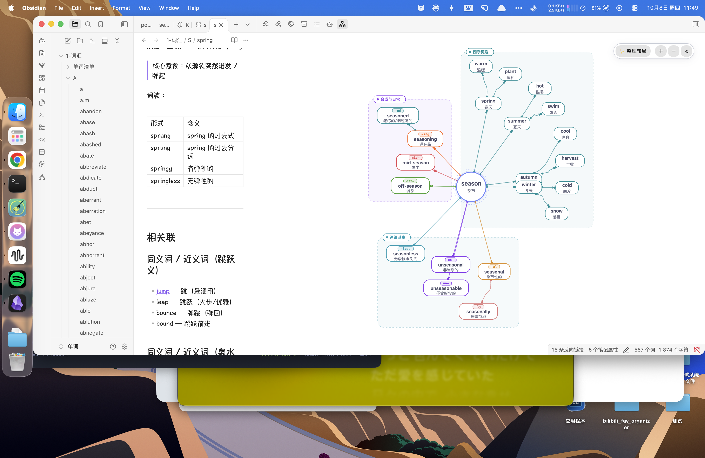

# Obsidian Radial Vocab (360° 单词星系导图)

[](https://github.com/kimi-ni-aitaku/obsidian-radial-vocab/releases)
[](https://opensource.org/licenses/MIT)
[](https://github.com/catppuccin/catppuccin)

**Obsidian Radial Vocab** is an Obsidian plugin that transforms your vocabulary notes into an aesthetic, interactive **360° Radial Galaxy Mindmap**.

Visualize word stems, affixes, derivations, and semantic families with smooth Bézier curves, zero-overlap physics auto-layout, and the soothing [Catppuccin](https://github.com/catppuccin/catppuccin) pastel palette.



---

## ✨ Features / 核心特性

- 🌌 **360° Celestial Galaxy Radial Layout (天体星系放射视图)**
  - Central word acts as a celestial sun orb with multi-layer orbital rings.
  - Derived words radiate concentrically with hierarchical distance tiers.
- 🎨 **Catppuccin Palette Integration (官方 Catppuccin 优雅配色)**
  - Fully styled with official **Latte (Light)** and **Mocha (Dark)** palettes.
  - Same affixes (e.g. `[un-]`, `[-al]`, `[-ly]`) automatically share identical color chips.
- 🛡️ **Zero-Overlap Boundary Physics (严格无重叠虚线包围框)**
  - Automatic sector allocation + physical collision resolver ensures **zero pill overlap** and **zero dashed module boundary overlap** ($\ge 28\text{px}$ clearance).
- 〰️ **Smooth Cubic Bézier Branches (优雅平滑贝塞尔曲线)**
  - Natural organic branch curves (inspired by Markmap & D3) with circular anchor beads.
- 🎛️ **Floating Glassmorphism Action Bar (毛玻璃操作胶囊栏)**
  - `✨ 整理布局` (One-click auto-align & layout reset)
  - `＋` / `－` (Smooth zoom in & out)
  - `⟲` (Recenter and fit view)
- 📝 **Native Markdown Driven (零门槛纯 Markdown 驱动)**
  - Works out of the box with standard Markdown lists and derivation formulas (`root + affix → word (definition)`).

---

## 📖 Syntax & Usage / 语法与用法

Write your word notes in standard Markdown:

```markdown
# season (季节)

## 四季更迭
- spring (春天)
  - warm (温暖)
  - plant (播种)
- summer (夏天)
  - hot (酷暑)
  - swim (游泳)
- autumn (秋天)
  - cool (凉爽)
  - harvest (丰收)
- winter (冬天)
  - cold (寒冷)
  - snow (落雪)

## 词缀派生
- season + [[-al]] → **seasonal**（季节性的）
  - seasonal + [[-ly]] → **seasonally**（随季节地）
- [[un-]] + seasonable → **unseasonable**（不合时令的）
- [[un-]] + seasonal → **unseasonal**（非当季的）
- season + [[-less]] → **seasonless**（无季候限制的）

## 合成与日常
- [[off-]] + season → **off-season**（淡季）
- [[mid-]] + season → **mid-season**（季中）
- season + [[-ing]] → **seasoning**（调味品）
  - season + [[-ed]] → **seasoned**（老练的/调过味的）
```

Open the side panel via:
1. Left ribbon icon: **"打开 360° 单词星系导图视图"**
2. Command palette (`Ctrl/Cmd + P`): `Radial Vocab: 打开 360° 单词星系导图视图`

---

## 📥 Installation / 安装指南

### Method 1: Obsidian Community Plugins (Recommended)
1. Open Obsidian **Settings** > **Community plugins**.
2. Turn off **Restricted mode**.
3. Click **Browse** and search for `Radial Vocab`.
4. Click **Install**, then **Enable**.

### Method 2: Via BRAT (Beta Reviewer's Auto-update Tool)
1. Install [BRAT](https://github.com/TfTHacker/obsidian42-brat) from Community plugins.
2. In BRAT settings, click **Add Beta plugin**.
3. Enter `kimi-ni-aitaku/obsidian-radial-vocab`.

### Method 3: Manual Installation
1. Download `main.js`, `manifest.json`, and `styles.css` from the [Latest Release](https://github.com/kimi-ni-aitaku/obsidian-radial-vocab/releases).
2. Create a folder named `radial-vocab` under `<VaultFolder>/.obsidian/plugins/`.
3. Copy the 3 downloaded files into that folder.
4. Reload Obsidian and enable **Radial Vocab** in Community plugins.

---

## 📄 License

This project is licensed under the [MIT License](LICENSE).
